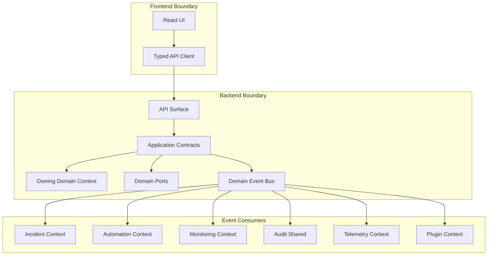

# API Contract Overview

Phase 6 defines stable, language-agnostic contracts for Atlas's 11 bounded contexts. These contracts describe what the application layer exposes and what the domain layer requires; they are not FastAPI routes, Pydantic models, TypeScript types, OpenAPI schemas, or implementation code.

## Contract Shape

Each bounded context exposes:

- **Commands**: imperative write use-cases owned by the application layer. Mutating commands include `project_id` when project-scoped, support dry-run where files/processes change, and accept an `idempotency_key` when retryable.
- **Queries**: read use-cases with explicit filters, pagination, and `project_id` scoping for project-owned data.
- **Published events**: past-tense domain facts emitted after a successful state transition.
- **Subscribed events**: facts from other contexts that trigger local reactions without cross-context domain reach-through.
- **Domain ports**: required driven-adapter interfaces. Ports are named by capability, not concrete library.
- **API surface**: route intents and structural request/response shapes for the frontend. Transport names can change later without changing application contracts.

## Layering Rules

Contracts must preserve:

```text
api -> application -> domain <- adapters
application -> infrastructure
frontend -> api schemas only
plugins -> capability-checked plugin contracts only
```

Direct application-layer calls are allowed only when one workflow synchronously coordinates another module's public application contract. Domain models from one bounded context never import or reach into another context's domain model, repository, database tables, or adapters.

Use the event bus for cross-context facts, automation triggers, incident enrichment, monitoring alerts, audit history, plugin lifecycle, and telemetry outcomes.

## Project Scope Invariant

Every project-scoped command, query, persistence port, and domain event payload includes `project_id`. Adapters and repositories must filter by `project_id` before any other user-controlled filter. Missing, mismatched, or unauthorized project scope fails with `ProjectScopeViolation`.

Global operations are explicitly marked, such as listing app-global plugin registrations, telemetry defaults, or project templates.

## Result And Error Envelope

Application contracts return a result envelope:

| Field | Meaning |
| --- | --- |
| `ok` | Boolean success marker. |
| `data` | Success payload, absent on error. |
| `error` | Typed error payload, absent on success. |
| `warnings` | Non-blocking safety or validation warnings. |
| `audit_ref` | Optional audit event, command plan, or command execution reference. |

Common domain errors:

| Error | Meaning |
| --- | --- |
| `NotFound` | Requested scoped entity does not exist. |
| `ValidationFailed` | Input or domain rule validation failed. |
| `Conflict` | State changed, version mismatch, duplicate, or unsafe concurrent operation. |
| `PermissionDenied` | User, trust, plugin, or capability policy denies the action. |
| `ProjectScopeViolation` | Operation lacks or crosses `project_id` scope. |
| `PreconditionFailed` | Required setup, backup, trust, artifact, or environment state is missing. |
| `ExternalAdapterFailed` | Filesystem, Git, FiveM, txAdmin, process, plugin, or telemetry adapter failed. |
| `TelemetryRejected` | Sanitizer rejected an Atlas telemetry payload. |
| `OperationCancelled` | User or system cancelled a long-running operation. |

Transport errors map from these contract errors. HTTP status codes and stream close codes are transport concerns, not domain concepts.

## Long-Running Operations

Commands that may take time return one or more references:

- `command_plan_id` for dry-run preview and approval state.
- `command_execution_id` for approved execution.
- `operation_id` for progress streams.
- `idempotency_key` for retryable writes and scheduled actions.
- `stream_topic` for progress events such as `operations/{operation_id}`, `projects/{project_id}/incidents`, or `projects/{project_id}/metrics`.
- `GET /api/v1/projects/{project_id}/stream?topics=...` for multiplexed SSE progress/log/metric events.

File and process mutations require preview-first contracts unless the operation is read-only or explicitly marked as safe.

## Inter-Module Event Flow



## API Surface Conventions

Route intents use plural nouns for collections and command verbs where a noun endpoint would hide intent:

- Queries: `GET /api/v1/projects/{project_id}/resources`
- Commands: `POST /api/v1/projects/{project_id}/resources/{resource_id}/commands/update-plan`
- Streams: `GET /api/v1/projects/{project_id}/stream?topics=server-output,op-progress,process-lifecycle,metrics`

These are route intents, not route handlers or OpenAPI definitions.

## Streaming Convention

Atlas exposes one multiplexed Server-Sent Events (SSE) stream per project over loopback HTTP:

- Route intent: `GET /api/v1/projects/{project_id}/stream`
- Query filter: `topics` comma list (`server-output`, `process-lifecycle`, `op-progress`, `metrics`)
- Resume: standard `Last-Event-ID` request header with monotonic `sequence` ids in SSE `id:` fields
- Payload shape: JSON with `sequence`, `topic`, `event_type`, `project_id`, `payload`, `occurred_at`
- Delivery policy: loss-sensitive topics (`server-output`, `process-lifecycle`, `op-progress`) never silently drop; slow consumers are closed. High-frequency `metrics` coalesces under a bounded buffer for future M6 samples.
- Privacy: server output, progress, and metrics are FiveM project data and remain on the local SSE transport only; they never enter telemetry.

Consumers subscribe to topics over the single connection. Do not open one HTTP connection per topic.

## Open Questions

- Whether Phase 7 should standardize route grouping by module or by `commands`/`queries`.
- Whether domain events should be persisted synchronously with command execution as an outbox.

## Deviations

None.
