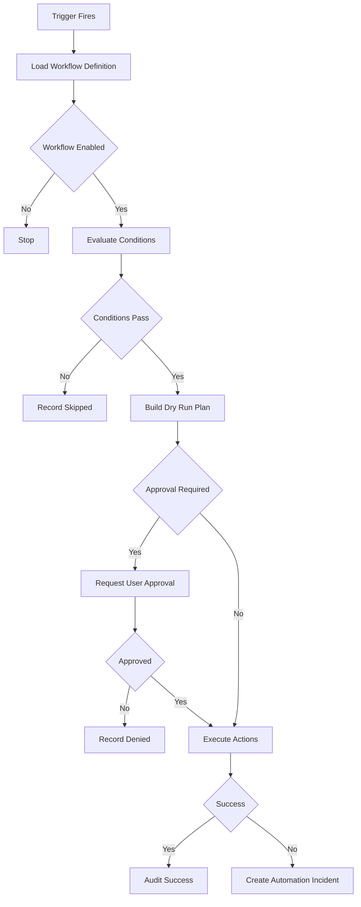
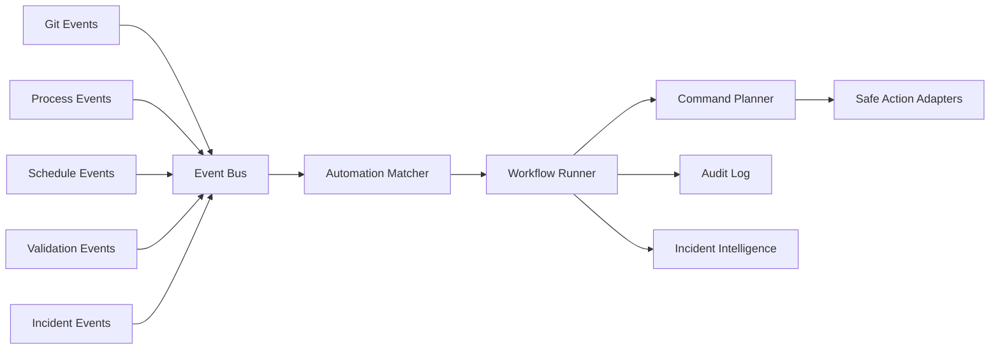

# Automation Engine

The Automation Engine runs local, explainable workflows triggered by schedules, project events, process events, Git events, validation results, incidents, or user actions. Automation must never hide file changes, process restarts, or destructive operations.

## Automation Model

An automation is a versioned workflow definition containing:
- Trigger.
- Conditions.
- Actions.
- Required capabilities.
- Approval policy.
- Dry-run behavior.
- Undo strategy.
- Audit metadata.
- Failure handling.

## Example Workflows

- When Git pull completes, validate resources, then optionally restart affected resources.
- When server crashes, capture incident, wait for cooldown, then restart server if policy allows.
- Nightly backup with retention enforcement.
- Before deployment, run validation and create a snapshot.
- When a config changes, validate and prompt for server restart.

## Workflow Diagram

## Scheduler Ownership

APScheduler can manage local schedules, but durable workflows must avoid duplicate execution. Use stable workflow IDs, explicit replacement behavior, and a single scheduler owner in the local backend process. If Atlas later supports multiple backend processes or remote nodes, scheduler ownership must be redesigned with locks or a dedicated scheduler service.

## Action Safety Classes

- Read-only: inspect status, validate config, list resources.
- Reversible write: edit generated config with snapshot, enable/disable resource with rollback.
- Process control: restart resource, restart server, stop server.
- Destructive: delete resource, prune backups, restore snapshot.
- External: network, webhook, or third-party integration.

Destructive and external actions require explicit user approval unless a future policy system proves a safe narrower exception.

## Event Integration

## Developer-First Requirements

- Every automation has a human-readable summary.
- Every action has a dry-run representation.
- Every run is auditable.
- Users can disable automations globally, per project, or per workflow.
- Automation-created file changes should include snapshots and diffs.
- Failures create local incidents with workflow context.

## Open Questions

- Should automation definitions be stored only in SQLite, or optionally exported as project-local YAML for versioning?
- Which actions are safe enough for unattended execution in MVP?
- How should plugin-contributed automation actions be tested and permissioned?
