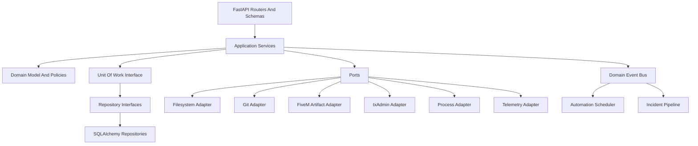

# Backend Architecture

The backend is a local FastAPI application managed by the Tauri shell. It hosts application services, domain modules, adapters, scheduling, incident processing, plugin coordination, and persistence. It is local-only by default and should bind to a loopback interface or equivalent private IPC boundary.

## Responsibilities

- Local API for frontend commands and queries.
- Domain service orchestration.
- Filesystem, Git, FXServer, txAdmin, database, and telemetry adapters.
- Long-running task supervision.
- Event bus publishing and subscriptions.
- Automation scheduling.
- Incident ingestion, grouping, and export generation.
- Plugin manifest loading and capability enforcement.

## Backend Layers

## FastAPI Guidance

Use lifespan context managers for startup and shutdown of shared resources. Avoid deprecated startup/shutdown event handlers. Use dependency injection for request-scoped services and Unit of Work instances. Use FastAPI `BackgroundTasks` only for lightweight post-response work that can safely be lost; durable work belongs in the Automation Engine or task supervisor.

## Persistence Guidance

SQLAlchemy Sessions implement Unit of Work behavior, but domain services should depend on a narrow Unit of Work interface. Sessions are not shared across threads or concurrent tasks. SQLite writes should be short, explicit, and serialized where needed.

## Local API Shape

- Commands: validate inputs, create dry-run plans, execute approved operations, and emit audit events.
- Queries: return project state, inventories, incident lists, metrics, plugin manifests, and automation definitions.
- Streams: expose logs, console output, progress events, monitoring samples, and incident updates.

## Process Ownership

The backend should supervise FXServer and helper processes through adapters. Process state changes should publish domain events and be visible in audit history. Crashes should become local incidents when enough context exists.

## Security Boundary

The backend is the only component with broad project access. It must enforce path allowlists, project trust, plugin capabilities, telemetry sanitization, and approval gates before executing commands or writing files.
