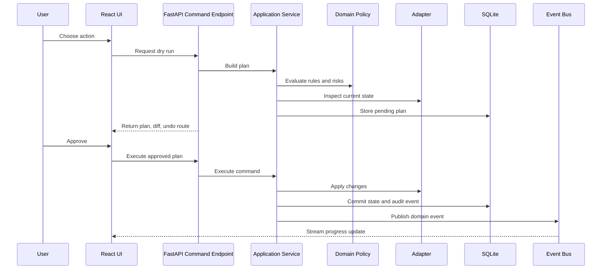
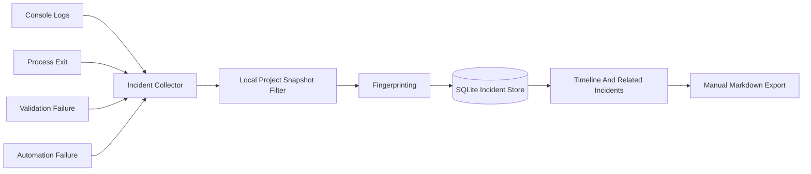
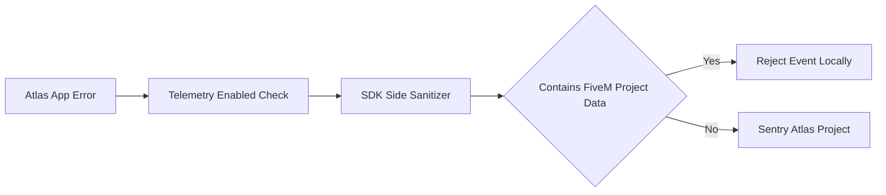

# Data Flow

Atlas data flow is designed around explicit intent, local execution, auditability, and privacy. The frontend requests plans; the backend evaluates risk; the user approves; adapters perform work; events update local state; incidents and audit records preserve context.

## Primary Command Flow

## Incident Data Flow

Incident data remains local. The local project snapshot filter is not the Atlas Sentry telemetry sanitizer; it prepares safe, relevant local incident context for the user's own viewing and manual export.

## Telemetry Data Flow

Telemetry is for Atlas application failures only. FiveM logs, configs, resources, databases, player data, and identifiers are never valid telemetry payloads.

## Local Storage Classes

- Durable metadata: SQLite.
- Large immutable backups: user-selected backup directory.
- Project source/config/resources: original project filesystem.
- Runtime logs: source locations plus optional indexed references.
- Markdown exports: user-chosen save location.

## Concurrency Rules

- UI interactions are optimistic only after a backend plan exists.
- Long-running operations emit progress events and can be cancelled when adapters support cancellation.
- SQLite writes are short and controlled by a Unit of Work.
- Scheduler actions must use stable IDs and idempotency keys to avoid duplicate runs.
