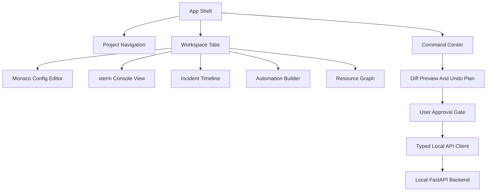

# Frontend Architecture

The frontend is a React and TypeScript application running in a Tauri WebView. It is responsible for presentation, local interaction state, command previews, editor surfaces, terminal views, dashboards, and explainable workflows. It does not directly read or write FiveM project files.

## Responsibilities

- Project navigation and global search.
- Wizard and workflow UI.
- Monaco-based configuration editing.
- xterm.js console and command streams.
- Diff, preview, approval, and undo-plan presentation.
- Incident timeline and Markdown export UI.
- Automation builder canvas.
- Plugin-contributed views after capability approval.

## Non-Responsibilities

- Direct filesystem mutation.
- Direct Git mutation.
- Direct SQLite access.
- Plugin execution outside approved UI rendering.
- Sentry event submission without backend sanitization policy.

## Component Model

## State Strategy

Use local UI state for transient interactions and backend-backed query state for project facts. Avoid duplicating durable state in the frontend. The backend remains the source of truth for projects, resources, incidents, automations, plugin capabilities, and audit history.

## Developer-First UX Rules

- Every mutating command has a dry-run path.
- Every workflow shows affected paths and process effects.
- Dangerous actions require explicit confirmation.
- Generated config and resource changes are shown as diffs.
- UI should explain why an action is recommended and how to undo it.

## Plugin UI Rules

Plugin UI must be isolated from core state. Plugin views receive only the data allowed by their capabilities and project trust state. Custom webview-like surfaces are allowed only when a declared contribution point cannot be represented with native Atlas components.
