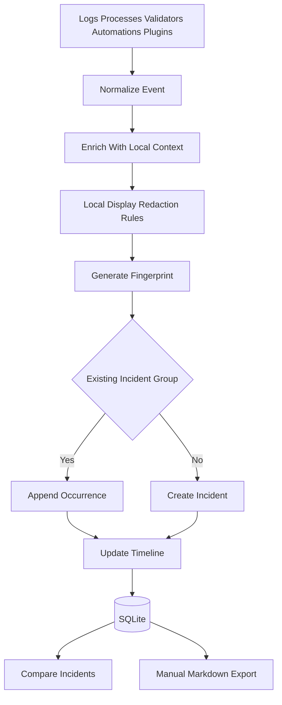
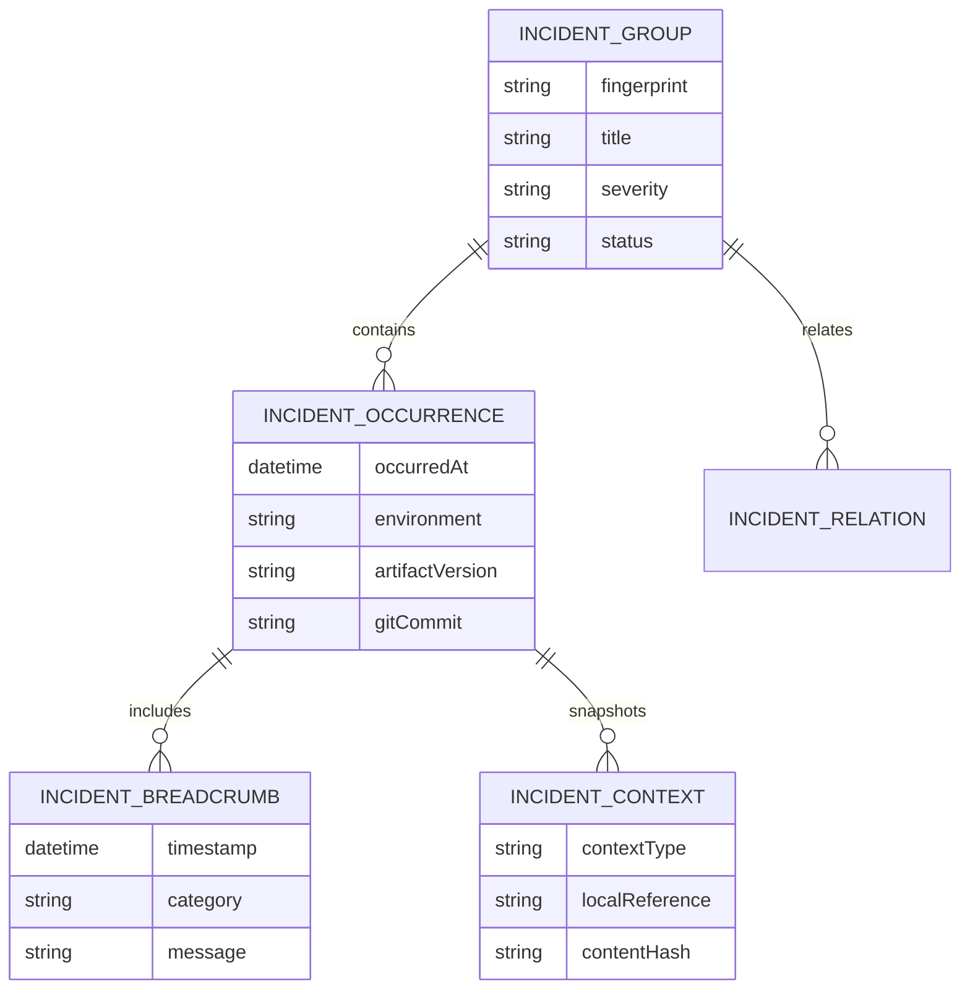

# Incident Intelligence

Incident Intelligence is Atlas's local Sentry-inspired debugging system for FiveM server development. It captures, groups, enriches, compares, and exports incidents without sending FiveM project data to any cloud service.

## Incident Sources

- FXServer crashes or abnormal exits.
- Resource startup failures.
- Runtime stack traces.
- Validation failures.
- Database connectivity failures.
- Automation failures.
- Backup/restore failures.
- Plugin failures.
- Atlas local backend failures that affect project workflows.

## Incident Record

Each incident should capture:
- Timestamp.
- Severity.
- Category.
- Error message.
- Stack trace when available.
- Recent logs.
- Runtime information.
- Loaded resources.
- Git commit and dirty state.
- Environment profile.
- Artifact version.
- Startup order.
- Relevant configuration excerpts.
- Related incidents.
- Fingerprint.
- Timeline.

## Pipeline

## Fingerprinting Strategy

Fingerprints should combine stable root-cause signals:
- Exception or error type.
- Top in-app stack frames when available.
- Resource name.
- Artifact version or channel.
- Server startup phase.
- Error category.
- Normalized message with volatile values removed.

Use stack-trace-inspired grouping but avoid overfitting to line numbers or timestamps. Allow future user rules for merging, splitting, and ignoring incidents.

## Timeline And Breadcrumbs

The timeline should include:
- Server start command.
- Artifact and environment profile.
- Resource load sequence.
- Recent Git operations.
- Recent config changes.
- Recent automation runs.
- Relevant console log excerpts.
- Process exit details.

Breadcrumbs are local and project-specific. They are never sent to Atlas's Sentry project.

## Markdown Export

Exports should be optimized for manual AI debugging:
- Problem summary.
- Reproduction context.
- Environment snapshot.
- Relevant logs.
- Stack traces.
- Resource list and startup order.
- Git state.
- Config excerpts selected by relevance.
- Prior related incidents.
- Explicit redaction notice.

No AI API integration should exist. The user decides whether to copy the Markdown into ChatGPT, Claude, Gemini, or a local model.

## Privacy Requirements

Incident data may include sensitive FiveM project data, so it remains local. Export generation should warn when reports contain logs, config values, player information, IPs, Discord tokens, database credentials, or license keys. Atlas should provide redaction tools but must not silently upload the report.

## Mermaid Incident Relationship Model

## Open Questions

- Which log sources are reliable across Windows and Linux FiveM setups?
- How much configuration should be included by default in AI-ready exports?
- Should redaction profiles be global, per-project, or per-export?
