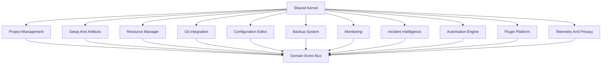

# Module Boundaries

Atlas modules are domain-oriented, not screen-oriented. Each module owns its language, policies, commands, queries, events, and ports. Modules may share kernel types, but they should not bypass application services to reach another module's database tables, adapters, or filesystem paths.

## Boundary Diagram

## Shared Kernel

The shared kernel should stay small:
- Project identifiers.
- Environment identifiers.
- Path references.
- Severity levels.
- Domain event envelope.
- Audit metadata.
- Result/error primitives.

Avoid placing business rules or adapter-specific details in the shared kernel.

## Module Contracts

Each module should expose:
- Commands for intentful mutations.
- Queries for read models.
- Events for completed facts.
- Ports for external dependencies.
- Policies for domain decisions.
- DTOs for API boundaries.

## Dependency Rules

- UI depends on API schemas, not domain internals.
- Application services depend on domain models and ports.
- Domain models do not depend on FastAPI, SQLAlchemy, Tauri, GitPython, APScheduler, or Sentry.
- Adapters implement ports and may depend on external libraries.
- Modules communicate through explicit service interfaces or domain events.

## Example Events

- `ProjectImported`
- `ArtifactVersionPinned`
- `ResourceUpdatePlanned`
- `ResourceUpdated`
- `ConfigValidationFailed`
- `BackupCreated`
- `ServerProcessCrashed`
- `IncidentCreated`
- `AutomationRunStarted`
- `PluginCapabilityDenied`
- `TelemetryEventRejected`

## Bounded Context Notes

Incident Intelligence may consume events from every module, but it should not own their data. It stores incident snapshots and references so reports remain useful even if project files later change.
