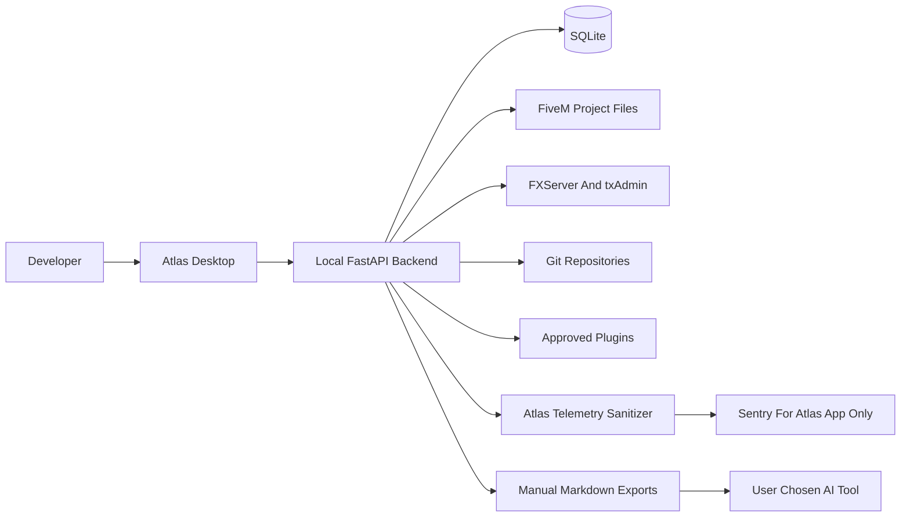
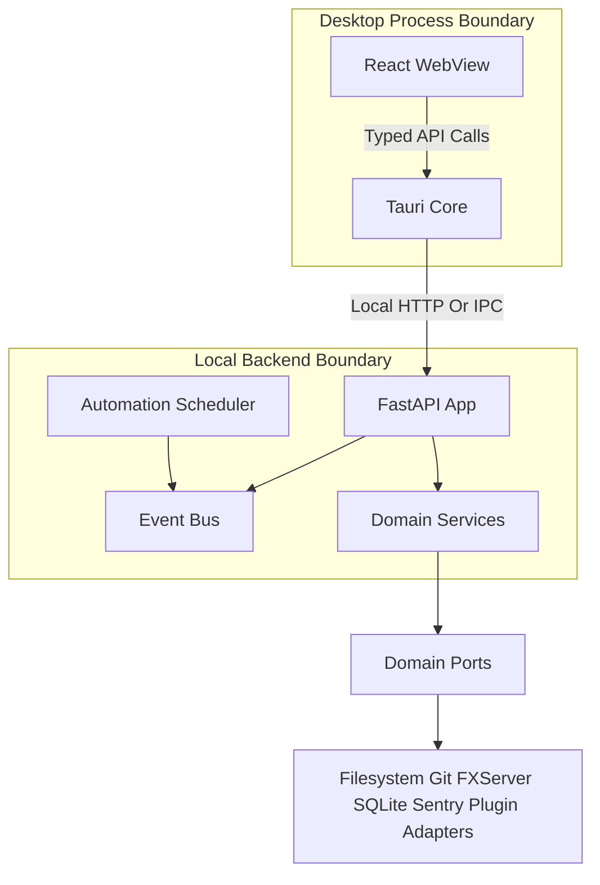
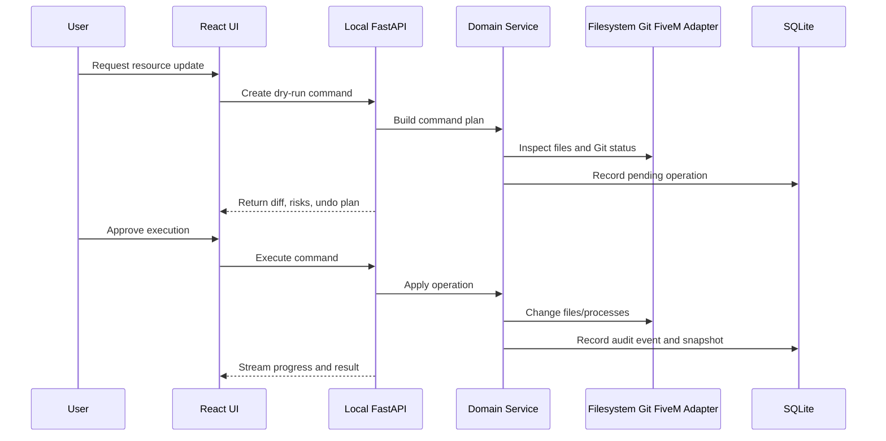

# Architecture Overview

Atlas is a local-first platform composed of a Tauri desktop shell, React frontend, local FastAPI backend, SQLite persistence, and bounded domain modules. The architecture uses hexagonal boundaries so the domain stays independent from UI, filesystem, Git, FiveM artifacts, txAdmin, Sentry, and plugin runtimes.

## Architectural Principles

- Offline-first: all core workflows run locally without accounts or cloud services.
- Privacy-first: FiveM project data never leaves the machine automatically.
- Developer-first: commands are previewed, explainable, auditable, and reversible where possible.
- Modular: features are organized around domain modules and stable ports/adapters.

## System Context

Sentry receives only Atlas application failures after sanitization. FiveM resources, logs, databases, configs, player data, IPs, identifiers, and secrets are not telemetry inputs.

## Process Model

Tauri owns native windowing, capability restrictions, and backend lifecycle orchestration. React owns UI state and interaction. FastAPI owns domain application services, long-running operations, filesystem access, scheduling, incident capture, and plugin coordination.

## Domain Modules

- Project Management
- Setup And Artifacts
- Resource Manager
- Git Integration
- Configuration Editor
- Backup System
- Monitoring
- Incident Intelligence
- Automation Engine
- Plugin Platform
- Telemetry And Privacy

Each module exposes commands, queries, events, ports, and adapters. Modules communicate through explicit service calls and domain events, not direct database or filesystem access.

## Data Flow

## Persistence Strategy

SQLite stores Atlas metadata: project records, resource inventory, environment profiles, incident metadata, fingerprints, automation definitions, scheduler state, backup catalogs, plugin registrations, telemetry preferences, and audit history. Large project files, resources, logs, and database backups remain in the user's project or backup locations, with Atlas storing references and hashes where useful.

SQLAlchemy Session behavior should be treated as the concrete Unit of Work. Atlas should still define a narrow Unit of Work interface so domain services are decoupled from ORM details.

## Integration Boundaries

- FiveM artifacts: adapter for discovery, version metadata, downloads, verification, and update plans.
- txAdmin: adapter for local process, `txData` awareness, config guidance, and optional API usage.
- Git: adapter for status, diffs, commits, branches, pulls, and per-resource repository metadata.
- Filesystem: adapter for safe writes, snapshots, restore, path normalization, and secret scanning.
- Sentry: adapter only for Atlas application telemetry after sanitization.
- Plugins: adapter boundary with manifest capabilities and approved extension points.

## Open Questions

- Whether the local backend should communicate over loopback HTTP, Tauri IPC commands, or a hybrid model.
- Whether plugins should initially execute in Python, JavaScript, WebAssembly, or a restricted manifest-driven runtime.
- Which FiveM framework recipes should be first-party in the MVP.
- Whether remote node management belongs in a later Atlas edition or should remain out of scope.

## Recommended Deviations

- Do not require Docker or Podman for the core product, even though isolation is attractive.
- Do not adopt CQRS globally; use it selectively for incident search and monitoring read models if needed.
- Do not use React Server Components as a default desktop UI pattern.
