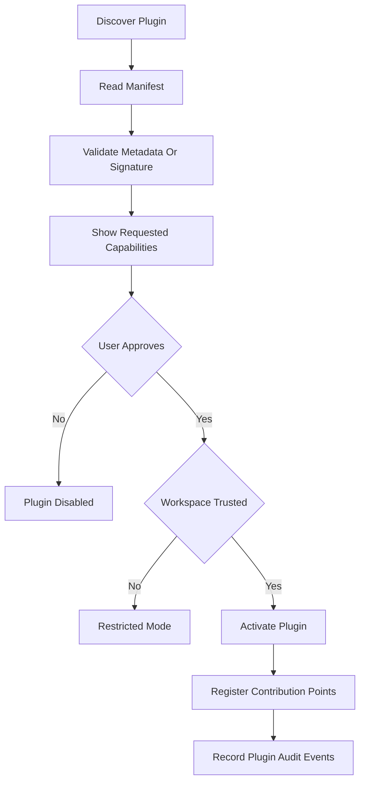
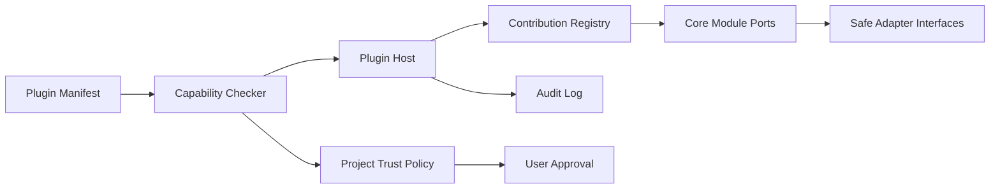

# Plugin System

Atlas plugins extend the platform without modifying core application code. The plugin system is manifest-first, capability-gated, project-trust-aware, and audited. Plugin power must be proportional to user consent because Atlas operates on sensitive local server projects.

## Goals

- Allow third parties to contribute useful FiveM development features.
- Keep core modules independently maintainable.
- Prevent plugins from bypassing privacy and developer-first guarantees.
- Make plugin contributions discoverable and removable.

## Contribution Points

- Commands.
- Sidebar or panel views.
- Resource providers.
- Setup recipes.
- Configuration validators.
- Incident enrichers.
- Markdown report exporters.
- Automation triggers.
- Automation actions.
- Monitoring collectors.

M9c contribution wiring is capability-mapped and subprocess-mediated:

| Contribution point | Required capability | M9c status |
| --- | --- | --- |
| Commands | `read-project-metadata` | Wired representative producing contribution |
| Configuration validators | `read-config` | Wired representative read contribution |
| Automation actions | `invoke-resource-lifecycle` | Wired representative mutating contribution |
| Resource providers | `invoke-resource-lifecycle` | Template only |
| Setup recipes | `invoke-setup-process` | Template only |
| Incident enrichers | `read-incidents` | Template only |
| Markdown report exporters | `read-incidents` + M7c sanitized export path | Deferred until export-audit gate is satisfied |
| Views | `render-ui` | Template only |
| Automation triggers | `contribute-automation` | Template only |
| Monitoring collectors | `contribute-monitoring` | Template only |

## Plugin Lifecycle

## Capability Model

Capabilities should be explicit and narrow:
- Read project metadata.
- Read specific project paths.
- Write specific project paths.
- Run validation only.
- Execute process commands.
- Access Git metadata.
- Create incidents.
- Contribute automation actions.
- Render plugin UI.
- Access network.

Network access should be denied by default. Any plugin that requests network access must explain why and must not receive FiveM project data unless a future user-approved export mechanism is explicitly designed.

## Runtime Strategy

M9b uses subprocess isolation plus stdlib JSON IPC. Plugins do not share Atlas memory, imports, or SQLite connections. This is not OS-level confinement: the plugin subprocess still has user-level filesystem/network privileges unless a future OS sandbox is added.

## Isolation Diagram

Plugins never receive raw adapter access. They interact with stable, permission-checked plugin APIs.

## Security Requirements

- Plugin install, enable, disable, and update are auditable.
- Capability changes require renewed approval.
- Project trust can disable risky plugin features.
- Plugin failures become Atlas incidents, not silent console errors.
- Plugins cannot alter telemetry sanitization rules to make them weaker.

## Open Questions

- Should the first executable plugin runtime be Python, JavaScript, WebAssembly, or external process based?
- Should Atlas support a plugin marketplace, local-only plugin folders, or both?
- How should plugin signing and publisher trust be handled for open-source distribution?
