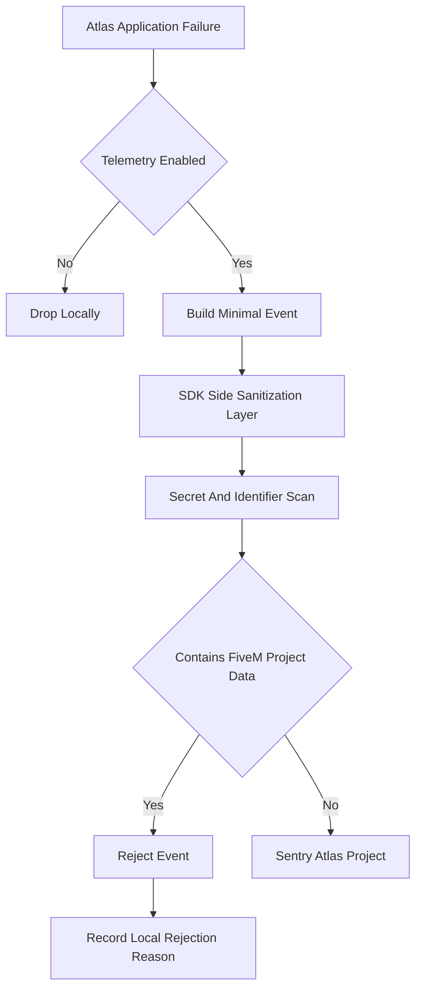
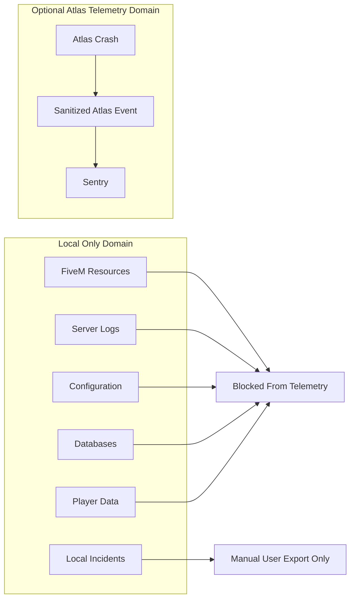

# Telemetry And Privacy

Atlas has two separate data domains: FiveM project data and Atlas application telemetry. FiveM project data is local-only. Atlas application telemetry is optional, limited to Atlas failures, and must pass through SDK-side sanitization before any Sentry upload.

## Data Classification

| Class | Examples | Default Handling |
| --- | --- | --- |
| FiveM project data | Resources, logs, configs, databases, player data, txAdmin data, server.cfg, identifiers | Local only; never automatic telemetry. |
| Atlas metadata | Project records, resource inventory, incident fingerprints, automation definitions, audit history | Local SQLite unless user exports. |
| Atlas app telemetry | Unhandled exceptions, renderer crashes, UI failures, backend task failures, plugin loading failures | Optional Sentry event after sanitization. |
| Manual exports | Incident reports, validation reports, architecture docs | User-controlled local files or clipboard. |

## Telemetry Pipeline

## Sanitization Requirements

Before sending anything to Sentry, remove:
- License keys.
- API keys.
- Discord tokens.
- Webhook URLs.
- IP addresses.
- Database credentials.
- Steam identifiers.
- Rockstar identifiers.
- Player information.
- File paths that reveal project names when possible.
- Environment variables except an allowlisted minimal subset.

Server-side Sentry scrubbing may be configured as defense in depth, but it is not sufficient because the data has already left the user's machine. SDK-side rejection and redaction are mandatory.

## Atlas Telemetry Allowlist

Allowed telemetry should be minimal:
- Atlas version.
- Operating system family and version.
- Tauri process type when relevant.
- Frontend route or backend subsystem name.
- Sanitized stack trace for Atlas code.
- Plugin identifier only when failure is plugin loading/execution, without plugin data payload.
- Non-identifying feature flag state.

Disallowed telemetry includes:
- FiveM project paths when they reveal user/project details.
- Resource names unless proven non-sensitive and explicitly allowed later.
- Logs from FXServer, txAdmin, databases, or resources.
- Config contents.
- Player count tied to a project.
- Database connection strings.

## Privacy Boundary Diagram

## User Controls

- Disable telemetry entirely.
- View what categories are collected.
- Inspect the latest sanitized telemetry payload before sending when practical.
- Clear local telemetry audit records.
- Disable plugin telemetry contribution.

## Incident Intelligence Privacy

Incident Intelligence intentionally stores sensitive FiveM context locally because that context is necessary for debugging. Markdown exports are manual and should include visible warnings when they may contain secrets, player data, IPs, or config values.

## Open Questions

- Should telemetry default to disabled or ask during onboarding?
- Should Atlas provide a "copy sanitized report" and "copy full local report" distinction for incident exports?
- How should path redaction balance debugging usefulness with privacy?
