# Database Overview

This Phase 5 design defines Atlas's intended SQLite schema only. It is not an ORM model, migration, SQL script, or dependency decision. The schema sits behind the `backend/adapters/persistence` adapter and the Unit of Work boundary described in `docs/architecture/backend.md`.

## Database Scoping Decision

Atlas should use **one app-global SQLite database** with `project_id` scoping for project-owned tables.

This fits the PRD better than an app-registry database plus per-project databases because Atlas needs multi-project navigation, global settings, plugin registrations, telemetry preferences, cross-project audit search, shared artifact cache metadata, and a single local backup target for Atlas metadata. Project data remains private and local; Atlas stores references, snapshots, hashes, and metadata rather than copying whole FiveM projects into the app database.

Per-project database export can be added later as a portability feature, but the source of truth remains the app-global database.

## SQLite Concurrency Model

Atlas should enable SQLite WAL mode for the app database:

- `journal_mode=WAL` so readers can continue while the single writer appends to the WAL.
- `busy_timeout` on every connection to reduce transient `SQLITE_BUSY` errors.
- Short write transactions owned by the backend Unit of Work.
- One logical writer path for scheduler, incident capture, automation runs, telemetry queue writes, and command execution audit records.
- Idempotency keys for automation and command paths that can be retried.
- Periodic checkpoint policy owned by the persistence adapter, not by individual modules.

SQLite still allows only one writer at a time. WAL improves reader/writer overlap, not write parallelism. Long-running jobs must collect data outside the transaction, then persist compact state in one short Unit of Work.

## Type Policy

Use SQLite affinities that map cleanly to SQLAlchemy 2.x later:

| Design type | SQLite affinity | Later SQLAlchemy intent |
| --- | --- | --- |
| Identifier | `TEXT` | UUID string or stable slug |
| Text | `TEXT` | `String` / `Text` |
| Boolean | `INTEGER` | `Boolean`, stored as 0/1 |
| Integer | `INTEGER` | `Integer` |
| Float | `REAL` | `Float` |
| Timestamp | `TEXT` | UTC ISO text via `DateTime` mapping |
| JSON document | `JSON` | SQLite JSON / SQLAlchemy JSON |
| Hash / bytes | `BLOB` or `TEXT` | `LargeBinary` or hex string |

All timestamps are UTC. Store external file paths as normalized `TEXT`, with path role and root type stored separately where useful.

## JSON Column Policy

JSON is acceptable for:

- Versioned snapshots.
- External payloads whose shape changes by provider.
- Incident context bundles.
- Automation condition/action definitions.
- Plugin manifests and capability payloads.
- Sanitized telemetry event payloads before delivery.

JSON is not acceptable for:

- Frequently filtered state.
- Foreign-key relationships.
- Retention boundaries.
- Timeline ordering.
- Severity/status/category fields.
- Anything requiring uniqueness or referential integrity.

If a JSON field becomes query-critical, promote the queried fields into normalized columns and keep the JSON as a source snapshot.

## Indexing Philosophy

Index:

- Every foreign key used for joins.
- Natural uniqueness keys such as `projects.slug`, `resources(project_id, resource_name)`, and `incident_groups(project_id, fingerprint)`.
- Timeline queries: `(project_id, occurred_at)`, `(incident_group_id, occurred_at)`.
- Scheduler queries: due schedules, pending approvals, running workflows.
- Monitoring time buckets and rollups.
- Telemetry queue state and next retry time.
- Audit and domain event streams by project, entity, and timestamp.

Avoid speculative indexes on low-cardinality booleans unless paired with a selective timestamp or project key.

## Retention And Downsampling

| Data class | Policy |
| --- | --- |
| Monitoring samples | Keep raw high-resolution samples for a short window; roll up into minute/hour/day aggregates. |
| Telemetry queue | Drop delivered payloads after a short audit window; retain rejection summaries longer than rejected raw payloads. |
| Incident history | Keep groups long-term; prune or compact old occurrences, breadcrumbs, and large context snapshots by project policy. |
| Markdown exports | Store metadata and local path/hash; do not store duplicate large export bodies unless user explicitly saves them in Atlas-managed storage. |
| Audit events | Retain long-term; allow per-project archival later. |

## Migration Strategy (Design Only)

Atlas should eventually use a migration system, but Phase 5 does not choose or configure one. The schema includes a `schema_migrations` table design so the persistence adapter can record applied versions later. Migrations should be idempotent, transactional where SQLite allows it, and paired with app metadata backups before destructive changes.

No Alembic files, migration scripts, or dependency pins are created in this phase.

## Full Schema Diagram

```mermaid
erDiagram
    PROJECTS ||--o{ PROJECT_PATHS : has
    PROJECTS ||--o{ ENVIRONMENT_PROFILES : has
    PROJECTS ||--o{ PROJECT_SETTINGS : has
    PROJECTS ||--o{ WORKSPACE_TRUST_DECISIONS : has
    PROJECT_TEMPLATES ||--o{ PROJECTS : creates
    PROJECTS ||--o{ PROJECT_ARTIFACT_PINS : pins
    ARTIFACT_VERSIONS ||--o{ PROJECT_ARTIFACT_PINS : selected
    PROJECTS ||--o{ SETUP_RUNS : runs
    SETUP_RECIPES ||--o{ SETUP_RUNS : uses
    SETUP_RUNS ||--o{ SETUP_RUN_STEPS : has
    SETUP_RUNS ||--o{ DEPENDENCY_CHECKS : records
    PROJECTS ||--o{ TXADMIN_INSTANCES : has
    PROJECTS ||--o{ RESOURCES : owns
    RESOURCES ||--o{ RESOURCE_VERSIONS : has
    RESOURCES ||--o{ RESOURCE_DEPENDENCIES : source
    RESOURCES ||--o{ RESOURCE_DEPENDENCIES : target
    RESOURCES ||--o{ RESOURCE_STATE_CHANGES : changes
    RESOURCES ||--o{ RESOURCE_HEALTH_SNAPSHOTS : measures
    RESOURCES ||--o{ RESOURCE_INSTALL_SOURCES : installs
    PROJECTS ||--o{ GIT_REPOSITORIES : has
    GIT_REPOSITORIES ||--o{ GIT_REFS : has
    GIT_REPOSITORIES ||--o{ GIT_COMMITS : has
    GIT_REPOSITORIES ||--o{ GIT_WORKTREE_STATUS_SNAPSHOTS : snapshots
    GIT_WORKTREE_STATUS_SNAPSHOTS ||--o{ GIT_FILE_CHANGES : contains
    GIT_REPOSITORIES ||--o{ GIT_OPERATIONS : records
    PROJECTS ||--o{ CONFIG_FILES : has
    CONFIG_FILES ||--o{ CONFIG_SNAPSHOTS : snapshots
    CONFIG_CHANGE_SETS ||--o{ CONFIG_SNAPSHOTS : before_after
    CONFIG_FILES ||--o{ CONFIG_VALIDATION_RUNS : validates
    CONFIG_VALIDATION_RUNS ||--o{ CONFIG_VALIDATION_FINDINGS : finds
    CONFIG_FILES ||--o{ SECRET_SCAN_FINDINGS : finds
    PROJECTS ||--o{ BACKUP_PLANS : has
    BACKUP_PLANS ||--o{ BACKUP_RUNS : runs
    BACKUP_RUNS ||--o{ BACKUP_ITEMS : contains
    BACKUP_RUNS ||--o{ BACKUP_RESTORE_RUNS : restores
    BACKUP_PLANS ||--o{ BACKUP_RETENTION_EVENTS : prunes
    PROJECTS ||--o{ METRIC_SOURCES : has
    METRIC_SOURCES ||--o{ METRIC_SERIES : emits
    METRIC_SERIES ||--o{ METRIC_SAMPLES : samples
    METRIC_SERIES ||--o{ METRIC_ROLLUPS : rolls_up
    PROJECTS ||--o{ MONITORING_ALERTS : has
    MONITORING_ALERTS ||--o{ MONITORING_ALERT_EVENTS : fires
    PROJECTS ||--o{ INCIDENT_GROUPS : has
    INCIDENT_GROUPS ||--o{ INCIDENT_OCCURRENCES : contains
    INCIDENT_GROUPS ||--o{ INCIDENT_FINGERPRINTS : has
    INCIDENT_OCCURRENCES ||--o{ INCIDENT_BREADCRUMBS : includes
    INCIDENT_OCCURRENCES ||--o{ INCIDENT_CONTEXT_SNAPSHOTS : snapshots
    INCIDENT_OCCURRENCES ||--o{ INCIDENT_STACK_TRACES : has
    INCIDENT_STACK_TRACES ||--o{ INCIDENT_STACK_FRAMES : contains
    INCIDENT_GROUPS ||--o{ INCIDENT_RELATED_GROUPS : relates
    INCIDENT_GROUPS ||--o{ INCIDENT_EXPORTS : exports
    INCIDENT_GROUPS ||--o{ INCIDENT_GROUP_RULES : rules
    INCIDENT_GROUPS ||--o{ INCIDENT_NOTES : notes
    PROJECTS ||--o{ AUTOMATION_WORKFLOWS : has
    AUTOMATION_WORKFLOWS ||--o{ AUTOMATION_WORKFLOW_VERSIONS : versions
    AUTOMATION_WORKFLOW_VERSIONS ||--o{ AUTOMATION_TRIGGERS : has
    AUTOMATION_WORKFLOW_VERSIONS ||--o{ AUTOMATION_CONDITIONS : has
    AUTOMATION_WORKFLOW_VERSIONS ||--o{ AUTOMATION_ACTIONS : has
    AUTOMATION_WORKFLOWS ||--o{ AUTOMATION_SCHEDULES : schedules
    AUTOMATION_WORKFLOW_VERSIONS ||--o{ AUTOMATION_RUNS : runs
    AUTOMATION_RUNS ||--o{ AUTOMATION_RUN_STEPS : steps
    AUTOMATION_RUNS ||--o{ AUTOMATION_APPROVALS : approvals
    AUTOMATION_RUNS ||--o{ AUTOMATION_IDEMPOTENCY_KEYS : guards
    PROJECTS ||--o{ TELEMETRY_PREFERENCES : scopes
    TELEMETRY_QUEUE ||--o{ TELEMETRY_SANITIZATION_RESULTS : sanitizes
    TELEMETRY_QUEUE ||--o{ TELEMETRY_DELIVERY_ATTEMPTS : attempts
    TELEMETRY_REJECTIONS ||--o{ TELEMETRY_SANITIZATION_RESULTS : explains
    PROJECTS ||--o{ AUDIT_EVENTS : records
    COMMAND_PLANS ||--o{ COMMAND_EXECUTIONS : executes
    PROJECTS ||--o{ DOMAIN_EVENTS : emits
    PLUGIN_REGISTRATIONS ||--o{ PLUGIN_CAPABILITY_GRANTS : grants
    LOCAL_FILES ||--o{ BACKUP_ITEMS : references
    TAGS ||--o{ ENTITY_TAGS : labels

    PROJECTS {
        TEXT project_id PK
        TEXT slug UK
        TEXT display_name
        TEXT status
        TEXT created_at
    }
    ENVIRONMENT_PROFILES {
        TEXT environment_id PK
        TEXT project_id FK
        TEXT name
        JSON settings_json
    }
    INCIDENT_GROUPS {
        TEXT incident_group_id PK
        TEXT project_id FK
        TEXT fingerprint
        TEXT status
        TEXT severity
    }
    INCIDENT_OCCURRENCES {
        TEXT occurrence_id PK
        TEXT incident_group_id FK
        TEXT occurred_at
        TEXT environment_id FK
        TEXT git_commit_sha
    }
    AUTOMATION_WORKFLOWS {
        TEXT workflow_id PK
        TEXT project_id FK
        TEXT name
        INTEGER is_enabled
    }
    AUTOMATION_RUNS {
        TEXT run_id PK
        TEXT workflow_version_id FK
        TEXT status
        TEXT started_at
    }
    METRIC_SAMPLES {
        TEXT sample_id PK
        TEXT series_id FK
        TEXT sampled_at
        REAL value
    }
    AUDIT_EVENTS {
        TEXT audit_event_id PK
        TEXT project_id FK
        TEXT event_type
        TEXT occurred_at
    }
```

The diagram shows the schema's main relationships. Per-context files define every table, column, key, index, constraint, retention rule, and rationale.

## Open Questions

- Whether very large incident context snapshots should be externalized to files immediately or only after a size threshold.
- Whether per-project export/import should generate a detached SQLite subset or a structured archive with JSON metadata.
- Whether monitoring rollup retention should be user-configurable globally, per project, or per metric source.

## Deviations

- The schema chooses a single app-global SQLite database instead of per-project databases. This is a deliberate simplification for multi-project navigation and global plugin/telemetry/audit concerns.
